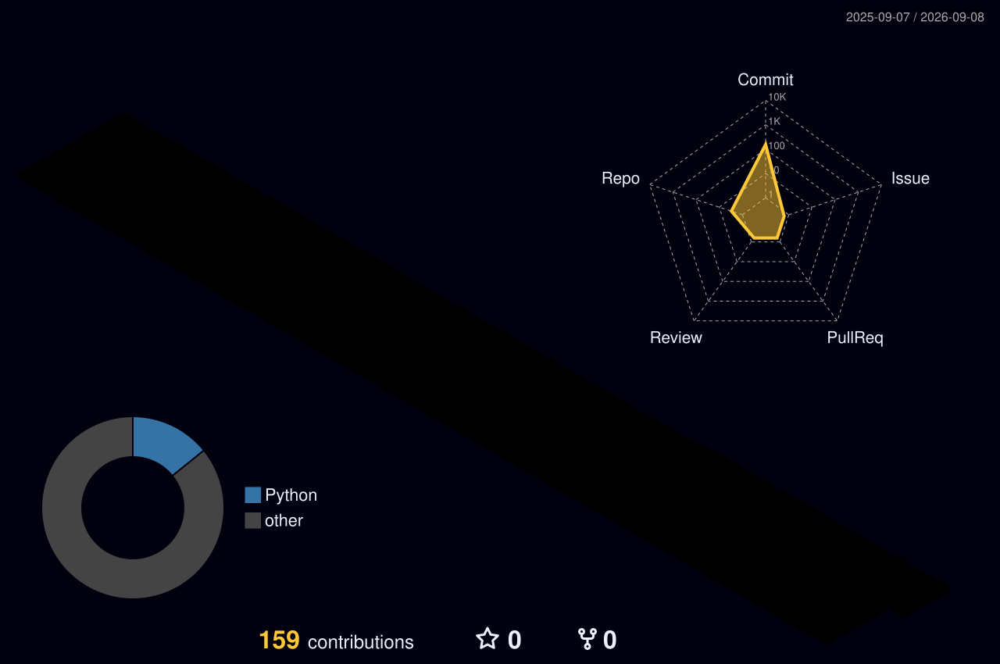

<!-- ═══════════════════════════════════════════════════════════════ -->
<!--                  TOP WAVE HEADER                              -->
<!-- ═══════════════════════════════════════════════════════════════ -->


<!-- ═══════════════════════════════════════════════════════════════ -->
<!--                  TYPING BANNER                                 -->
<!-- ═══════════════════════════════════════════════════════════════ -->
<div align="center">

[;🤖+GenAI+RAG+Pipeline+on+Amazon+Bedrock+%E2%80%94+4hr+→+15min+Fault+Resolution;🏗️+Medallion+Architecture+%7C+EMR+Serverless+%7C+Step+Functions+%7C+PySpark;💡+EV+Fleet+Analytics+%7C+Streaming+%7C+CI%2FCD+%7C+IaC+CloudFormation;🧠+Bedrock+Titan+V2+%7C+S3+Vectors+%7C+Semantic+Search+%7C+Serverless+RAG)](https://git.io/typing-svg)

</div>

<br/>

<!-- ═══════════════════════════════════════════════════════════════ -->
<!--                  IMPACT METRICS ROW                           -->
<!-- ═══════════════════════════════════════════════════════════════ -->
<div align="center">


</div>

<br/>

<!-- ═══════════════════════════════════════════════════════════════ -->
<!--                  ABOUT + STATS GRID                           -->
<!-- ═══════════════════════════════════════════════════════════════ -->
<table border="0" cellspacing="0" cellpadding="0">
<tr>
<td width="52%" valign="top">

### 🧑‍💻 `whoami`

```yaml
╔══════════════════════════════════════════════╗
║  👤  Shiva Kumar Nalabothula                 ║
║  🎯  AWS Data Engineer + GenAI               ║
║  📍  Hyderabad, Telangana, India             ║
║  📧  shivakumar.nalu@gmail.com               ║
╠══════════════════════════════════════════════╣
║  🏭  domain:                                 ║
║      EV Motor Manufacturing & Fleet          ║
║      Telemetry | Industrial IoT              ║
║      Energy Utilities | Logistics            ║
╠══════════════════════════════════════════════╣
║  🔥  production_highlights:                  ║
║    - 50M+ telemetry records/day              ║
║    - ~500 GB/day fully automated             ║
║    - ~70% compute cost cut (EMR Serverless)  ║
║    - 4hr → 15min fault resolution (RAG)      ║
║    - 40hrs/week manual work eliminated       ║
║    - >99.8% Gold layer data accuracy         ║
║    - ~85% Athena scan cost reduction         ║
╠══════════════════════════════════════════════╣
║  📚  currently_learning:                     ║
║    - AWS DEA-C01 (Expected 2026)             ║
║    - Databricks Data Engineer Associate      ║
║    - dbt Fundamentals                        ║
╚══════════════════════════════════════════════╝
```

</td>
<td width="48%" valign="top" align="center">

<br/>


<br/>


<br/>


</td>
</tr>
</table>

---

<!-- ═══════════════════════════════════════════════════════════════ -->
<!--                  3D CONTRIBUTION GRAPH                        -->
<!-- ═══════════════════════════════════════════════════════════════ -->

### 🗓️ 3D Contribution Calendar

<div align="center">



</div>

---

<!-- ═══════════════════════════════════════════════════════════════ -->
<!--                  SNAKE ANIMATION                              -->
<!-- ═══════════════════════════════════════════════════════════════ -->

### 🐍 Contribution Snake

<div align="center">

<picture>
  <source media="(prefers-color-scheme: dark)" srcset="https://raw.githubusercontent.com/ShivaKumar-DE-AWS/ShivaKumar-DE-AWS/output/github-snake-dark.svg"/>
  <source media="(prefers-color-scheme: light)" srcset="https://raw.githubusercontent.com/ShivaKumar-DE-AWS/ShivaKumar-DE-AWS/output/github-snake.svg"/>
  
</picture>

</div>

---

<!-- ═══════════════════════════════════════════════════════════════ -->
<!--                  TECH STACK                                   -->
<!-- ═══════════════════════════════════════════════════════════════ -->

### 🛠️ Tech Stack

<div align="center">

**☁️ AWS Core**


**🤖 AWS AI / GenAI**


**⚡ Languages & Processing**


**🔄 Orchestration & Streaming**


**🏗️ DevOps & IaC**


**📊 BI & Data Formats**


</div>

---

<!-- ═══════════════════════════════════════════════════════════════ -->
<!--                  CORE ARCHITECTURE                            -->
<!-- ═══════════════════════════════════════════════════════════════ -->

### 🏗️ Core Architecture — What I Build

```
╔═════════════════════════════════════════════════════════════════════════════════════╗
║                   PRODUCTION MEDALLION DATA PLATFORM (AWS)                        ║
╠══════════════╦══════════════════════╦═══════════════════════╦══════════════════════╣
║  DATA SOURCE ║  🥉 BRONZE LAYER      ║   🥈 SILVER LAYER      ║   🥇 GOLD LAYER       ║
╠══════════════╬══════════════════════╬═══════════════════════╬══════════════════════╣
║ Fleet CSV    ║  Raw Parquet in S3   ║  7 derived columns    ║  fact_motor_runs     ║
║ CAN Bus      ║  Lambda ingest       ║  DQDL 50+ rules       ║  agg_daily_motor_kpi ║
║ Kinesis      ║  Zero data loss      ║  Quarantine pattern   ║  fault_event_patterns║
║ API / Kafka  ║  Date partitioned    ║  Schema enforced      ║  energy_efficiency   ║
╠══════════════╬══════════════════════╬═══════════════════════╬══════════════════════╣
║   COMPUTE    ║  Lambda + Boto3      ║  EMR Serverless       ║  Athena SQL          ║
║   SAVINGS    ║                      ║  PySpark              ║  Redshift Spectrum   ║
╠══════════════╩══════════════════════╩═══════════════════════╩══════════════════════╣
║  ORCHESTRATION : AWS Step Functions (retry + parallel) + Apache Airflow (SLA)     ║
║  IaC / CI-CD  : CloudFormation + CodeBuild + pytest on every commit               ║
║  ALERTS       : SNS + CloudWatch + Slack + Telegram Bot (n8n)                     ║
║  COST IMPACT  : ~70% compute ↓  |  ~85% Athena scan cost ↓  (Parquet partition)  ║
╚═════════════════════════════════════════════════════════════════════════════════════╝

╔═════════════════════════════════════════════════════════════════════════════════════╗
║                   GENERATIVE AI — SERVERLESS RAG PIPELINE                         ║
╠══════════════╦══════════════════════╦═══════════════════════╦══════════════════════╣
║  KNOWLEDGE   ║  📥 INGESTION λ       ║   🧠 EMBEDDING λ       ║   🔍 QUERY λ          ║
║  BASE        ║  NLP enrichment      ║  Titan V2 1024-dim    ║  Cosine similarity   ║
║  Motor docs  ║  9-cat classifier    ║  S3 Vectors index     ║  Top-K retrieval     ║
║  Fault codes ║  Bedrock Converse    ║  PII safety-net       ║  Nova Lite answers   ║
║  SOPs        ║  temp=0.1, 500 tok   ║  Zero data loss       ║  temp=0.2, 650 tok   ║
╠══════════════╩══════════════════════╩═══════════════════════╩══════════════════════╣
║  RESULT: Fault resolution time      4 hours  →  under 15 minutes  🎯              ║
║  UI: Serverless browser (S3 + Lambda Function URL + CORS) — zero infra cost       ║
╚═════════════════════════════════════════════════════════════════════════════════════╝
```

---

<!-- ═══════════════════════════════════════════════════════════════ -->
<!--                  FEATURED PROJECTS                            -->
<!-- ═══════════════════════════════════════════════════════════════ -->

### 🚀 Featured Projects

---

<details open>
<summary><b>🤖 EV Motor Maintenance Intelligence — RAG System</b> &nbsp;|&nbsp; <code>Amazon Bedrock · Titan V2 · Nova Lite · S3 Vectors · Lambda</code></summary>
<br/>

> **Serverless 4-Lambda Generative AI pipeline** converting Airgap's entire EV motor knowledge base into a queryable RAG system — field engineers resolve motor faults in natural language in under 15 minutes instead of 4 hours.

| Lambda | Role | Model / Service |
|---|---|---|
| 📥 **Ingestion λ** | Loads docs, NLP enrichment, 9-category classification, PII safety-net | Bedrock Converse API (temp=0.1, 500 tok) |
| 🧠 **Embedding λ** | 1024-dim vector embeddings, S3 Vectors indexing | Bedrock Titan Embeddings V2 |
| 🔍 **Query λ** | Cosine similarity top-K retrieval + grounded answers | Amazon Nova Lite (temp=0.2, 650 tok) |
| 🌐 **UI λ** | Serverless browser app | Lambda Function URL + S3 + CORS |

**9 Classification Categories:**
`fault_code_lookup` · `maintenance_schedule` · `torque_spec` · `thermal_limit` · `winding_procedure` · `controller_config` · `warranty_query` · `parts_reference` · `safety_protocol`

**Impact:** ⏱️ **4 hours → under 15 minutes** fault resolution for field engineers and fleet maintenance teams

[](https://github.com/ShivaKumar-DE-AWS/ev-motor-rag-pipeline)


</details>

---

<details open>
<summary><b>⚡ EV Fleet Motor Analytics Platform</b> &nbsp;|&nbsp; <code>EMR Serverless · PySpark · Step Functions · FastAPI · CloudFormation · CI/CD</code></summary>
<br/>

> **Fully automated production Medallion platform** ingesting EV motor telemetry from 3 fleet operator clients at 50M+ records/day (~500 GB/day) — with CI/CD, IaC, REST API, and real-time fault alerting.

| Layer | Compute | Output |
|---|---|---|
| 🥉 Bronze | Lambda + Boto3 | Raw Parquet, date-partitioned, S3 |
| 🥈 Silver | EMR Serverless PySpark | 7 derived columns + 50+ DQDL quality rules |
| 🥇 Gold | Glue + Athena | 6 analytical tables, sub-10s queries |

**6 Gold Tables:**
`fact_motor_runs` · `dim_vehicles` · `dim_fleet_clients` · `agg_daily_motor_kpi` · `agg_fault_event_patterns` · `agg_energy_efficiency_trends`

**7 Silver Derived Columns:**
`motor_efficiency_pct` · `thermal_status_flag` · `torque_deviation_pct` · `range_estimate_km` · `fault_code_category` · `energy_regen_kwh` · `charge_cycle_stage`

**5 REST API Endpoints (FastAPI on Lambda):**
`/motor_health_summary` · `/daily_fleet_kpi` · `/fault_event_analysis` · `/energy_efficiency_trends` · `/predictive_maintenance_alerts`

**Impact metrics:**
- 🟢 **~70%** compute cost reduction vs persistent EMR cluster
- 🟢 **~85%** Athena scan cost reduction via Parquet partitioning
- 🟢 **>99.8%** Gold layer data accuracy
- 🟢 **40 hrs/week** manual effort eliminated across 3 teams
- 🟢 **Real-time Telegram bot** (n8n) for proactive fault alerts

[](https://github.com/ShivaKumar-DE-AWS/ev-fleet-motor-analytics)


</details>

---

<details open>
<summary><b>🎬 YouTube Trending Data Pipeline</b> &nbsp;|&nbsp; <code>Step Functions · Glue PySpark · Lambda · Athena · EventBridge</code></summary>
<br/>

> **Fully automated multi-region Medallion pipeline** ingesting live YouTube trending data across 10 countries — 5-stage Step Functions workflow with DQ gate, Hive partitioning, and Gold tables for sub-10s Athena queries.

| Feature | Detail |
|---|---|
| 🌍 Regions | US · GB · CA · DE · FR · **IN** · JP · KR · MX · RU |
| ⏰ Schedule | EventBridge every 6 hours — fully automated |
| 🔁 Retry | Exponential backoff (BackoffRate=2, max 3 attempts) |
| ✅ DQ Gate | 5 checks: row count ≥10, null% <5%, schema, value ranges, freshness <48h |
| 🪟 Dedup | Window `row_number()` deduplication on Silver layer |
| 📦 Format | Parquet/Snappy with Hive partitioning `region={r}/date={d}/hour={h}/` |

**3 Gold Analytics Tables:** `trending_analytics` · `channel_analytics` · `category_analytics`

[](https://github.com/ShivaKumar-DE-AWS/youtube-trending-data-pipeline)


</details>

---

<!-- ═══════════════════════════════════════════════════════════════ -->
<!--                  EXPERIENCE TIMELINE                          -->
<!-- ═══════════════════════════════════════════════════════════════ -->

### 💼 Professional Journey

```
2026  ╔═══════════════════════════════════════════════════════════════════════╗
      ║  🔶  Data Engineer @ Airgap Technology Pvt Ltd                       ║
      ║       Hyderabad  |  Sep 2023 – Jun 2026  (2.75 years)                ║
      ║                                                                       ║
      ║  🤖  EV Motor Maintenance Intelligence RAG System (May 2025–Jun 2026) ║
      ║      Amazon Bedrock Titan V2 · S3 Vectors · 4-Lambda serverless      ║
      ║      Fault resolution: 4 hours → under 15 minutes                   ║
      ║      9-category NLP classifier + PII safety-net                      ║
      ║                                                                       ║
      ║  ⚡  EV Fleet Motor Analytics Platform (Sep 2023–Apr 2025)            ║
      ║      EMR Serverless PySpark · CI/CD · IaC · FastAPI · n8n            ║
      ║      50M+ records/day · ~70% cost ↓ · 40 hrs/wk manual effort ↓     ║
      ║      50+ DQDL rules · >99.8% accuracy · 3 fleet operator clients     ║
      ╚═══════════════════════════════════════════════════════════════════════╝
2023  ╔═══════════════════════════════════════════════════════════════════════╗
      ║  🔷  Junior Engineer — Data & Technology @ CLN Energy Ltd          ║
      ║       Hyderabad  |  Aug 2022 – Aug 2023                              ║
      ║       25% data entry error reduction · analytics for energy ops       ║
      ╚═══════════════════════════════════════════════════════════════════════╝
2022  ╔═══════════════════════════════════════════════════════════════════════╗
      ║  🔹  Engineering Intern — Data & Simulation @ Pupilfirst (Remote)     ║
      ║       Built EV powertrain ETL pipeline: WLTC CSV → SciLab → Output   ║
      ║       Transformed IC engine data into EV-equivalent model             ║
      ╚═══════════════════════════════════════════════════════════════════════╝
```

---

<!-- ═══════════════════════════════════════════════════════════════ -->
<!--                  CERTIFICATIONS                               -->
<!-- ═══════════════════════════════════════════════════════════════ -->

### 🏆 Certifications

<div align="center">

| Status | Certification | Issuer | Year |
|:---:|---|---|:---:|
| ✅ | Data Engineering on AWS — Foundations | Amazon Web Services | Apr 2026 |
| ✅ | Amazon Athena Getting Started | Amazon Web Services | May 2026 |
| ✅ | AWS Educate: Databases · Storage · Cloud 101 (×3) | Amazon Web Services | 2024 |
| ✅ | AI Fundamentals & Ecosystem Mastery (IIT Kharagpur) | be10X AI Career Accelerator | Apr 2026 |
| 🔄 | **AWS Certified Data Engineer — Associate (DEA-C01)** | Amazon Web Services | 2026 |
| 🔄 | **Databricks Data Engineer Associate** | Databricks Academy | In Progress |
| 🔄 | **dbt Fundamentals** | dbt Labs | In Progress |
| 📅 | Google Cloud Professional Data Engineer | Google Cloud | Planned |

</div>

---

<!-- ═══════════════════════════════════════════════════════════════ -->
<!--                  ACTIVITY GRAPH                               -->
<!-- ═══════════════════════════════════════════════════════════════ -->

### 📊 Contribution Activity

<div align="center">

[](https://github.com/ShivaKumar-DE-AWS)

</div>

---

<!-- ═══════════════════════════════════════════════════════════════ -->
<!--                  CONNECT                                      -->
<!-- ═══════════════════════════════════════════════════════════════ -->

### 🌐 Let's Connect

<div align="center">

[](https://shiva-dataengineer-portfolio.lovable.app/)
[](https://linkedin.com/in/shiva-kumar-nalabothula-090b021a9)
[](https://github.com/ShivaKumar-DE-AWS)
[](mailto:shivakumar.nalu@gmail.com)

<br/>


<br/>

*"I don't just move data — I build systems that make it trustworthy, fast, and actionable."* ⚡

</div>

<!-- ═══════════════════════════════════════════════════════════════ -->
<!--                  FOOTER WAVE                                  -->
<!-- ═══════════════════════════════════════════════════════════════ -->

